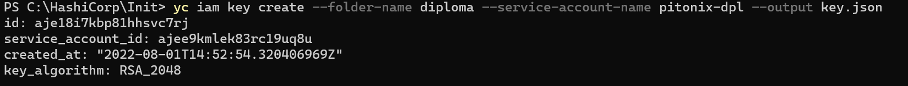
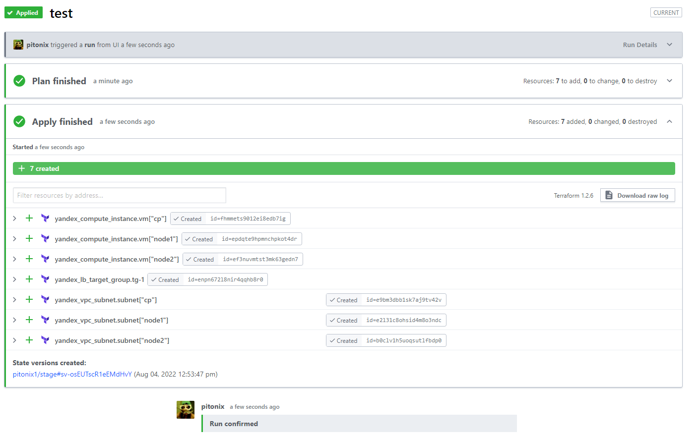
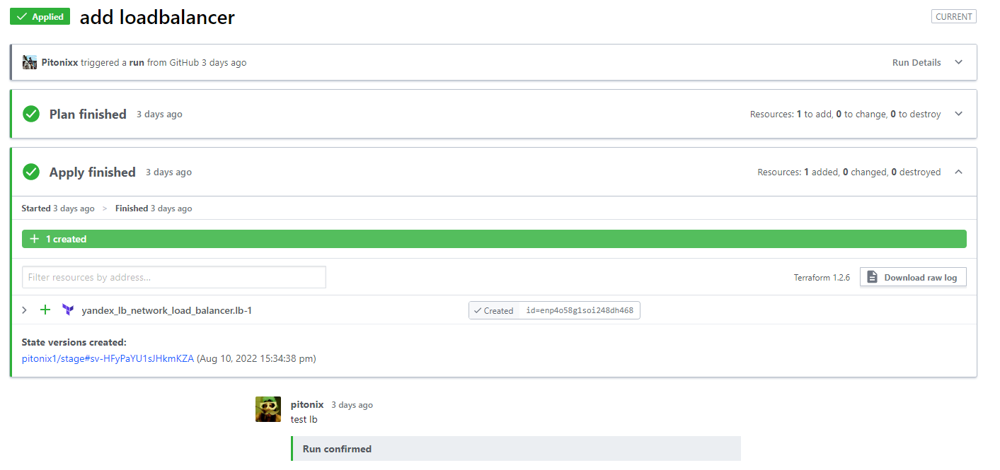

# Diploma-ND9-Terraform
 
## Создание облачной инфраструктуры

Для backend выбран Terraform Cloud.
Создано 2 Workspace Stage и Prod, оба подключены к этому репозиторию, в prod залочены действия, сначала отрабатывает stage. 
Все Apply запускаются вручную, автоматически происходит Plan после каждого git push.
Предварительно в Yandex Cloud создана директория Diploma, в которой происходит разворачивание и сервисный аккаунт от имени которого производятся действия. Авторизованный ключ экспортирован  в key.json, а оттуда выгружен уже в переменные Terraform Cloud ("YC_SERVICE_ACCOUNT_KEY_FILE"), там же добавлены "CLOUD_ID" и "FOLDER_ID" от YC.

Конфигурация для Terraform Cloud - [main.tf](main.tf).

Создан сервисный аккаунт:

Отработал Apply по виртуальным машинам и сети:
 

 Отработал Apply по Load Balancer-у:

  